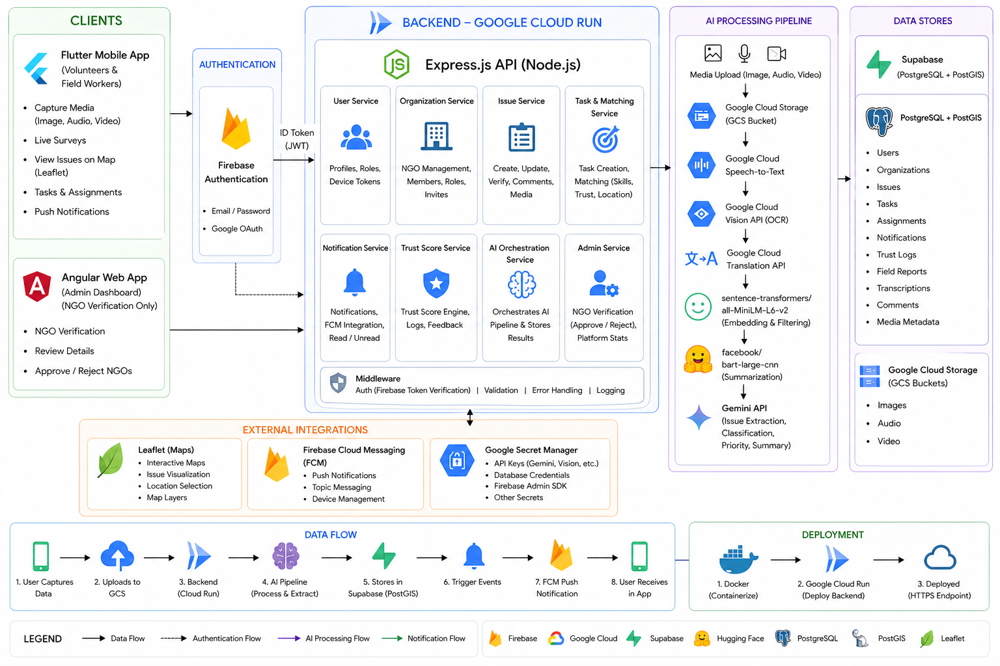

# NGO Connect — Smart Resource Allocation Platform

> Google Solution Challenge 2026

A full-stack civic-tech platform that transforms fragmented field data — surveys, photos, audio recordings, and reports — into structured, prioritized community issues, then intelligently matches those issues to the right volunteers and NGOs in real time.

---

## Table of Contents

- [Problem Statement](#problem-statement)
- [Solution Overview](#solution-overview)
- [Architecture](#architecture)
- [Tech Stack](#tech-stack)
- [Core Features](#core-features)
- [Project Structure](#project-structure)
- [Getting Started](#getting-started)
- [AI Pipeline](#ai-pipeline)
- [Data Flow](#data-flow)
- [Deployment](#deployment)
- [Team](#team)
- [License](#license)

---

## Problem Statement

Local NGOs and community groups capture critical information about ground-level needs through paper surveys, field audio, and photos. This data almost never makes it into a system where it can drive decisions. When it does, it sits in silos — scattered across devices, folders, and email chains — making it impossible to see the full picture of what a community actually needs.

The result: urgent problems go unaddressed not because resources don't exist, but because no one knows where to direct them.

**NGO Connect solves this.** It gives field workers a dead-simple way to capture multimedia reports, runs those reports through an AI pipeline that structures and prioritizes them, and then surfaces the right volunteers and organizations to act on what matters most.

---

## Solution Overview

The platform has three distinct surfaces built for three distinct audiences:

**Field Workers & Volunteers** use the Flutter mobile app to capture reports in the field — images, audio, video, or typed text — view issues on a live map, receive task assignments, and track their impact over time.

**NGO Administrators** use the Angular web dashboard to verify organizations, review incoming issues, approve volunteer assignments, and monitor community-wide analytics.

**The AI Pipeline** sits in the backend and handles the heavy lifting: transcribing audio, reading images, normalizing multilingual input, filtering noise, compressing content, and finally using Gemini to generate structured issue records with category, urgency score, and priority ranking.

---

## Architecture



The system is organized into five layers:

- **Clients** — Flutter (mobile) and Angular (web)
- **Authentication** — Firebase Auth with JWT, verified on every backend request
- **Backend** — Express.js API on Google Cloud Run, organized into domain services
- **AI Processing Pipeline** — Chained GCP AI services feeding into Gemini
- **Data Stores** — Supabase (PostgreSQL + PostGIS) for structured data, GCS for media

---

## Tech Stack

### Mobile (Flutter)
- Dart / Flutter
- Firebase Authentication
- Leaflet-based map views
- Firebase Cloud Messaging (push notifications)

### Web (Angular)
- Angular 17+ with standalone components
- TailwindCSS
- Firebase Authentication
- Vite build tooling

### Backend (Node.js / Express)
- Express.js on Google Cloud Run
- Prisma ORM
- Firebase Admin SDK (token verification)
- Cloudinary + Google Cloud Storage (media)
- Nodemailer (email)

### Database
- Supabase — PostgreSQL + PostGIS extension
- Geographic queries: nearby NGO matching, volunteer proximity, issue heatmaps

### AI Pipeline
| Stage | Service |
|---|---|
| Audio transcription | Google Cloud Speech-to-Text |
| Image text extraction | Google Cloud Vision API (OCR) |
| Language normalization | Google Cloud Translation API |
| Semantic filtering | `sentence-transformers/all-MiniLM-L6-v2` |
| Content summarization | `facebook/bart-large-cnn` |
| Issue structuring | Gemini API |

### Infrastructure
- Docker + Google Cloud Run (backend)
- Google Cloud Storage (media buckets)
- Google Secret Manager (credentials)
- Firebase Cloud Messaging (push)
- Google Maps API (frontend maps)

---

## Core Features

### Field Data Capture
Volunteers submit reports from anywhere — photo, audio recording, video, or free text. The app works as a lightweight capture tool; the intelligence lives in the backend.

### AI-Powered Issue Structuring
Every submission passes through the full AI pipeline. By the time a report reaches the database, it has a category, urgency score, priority ranking, and clean summary — regardless of what language it was submitted in or what format it arrived in.

### Geospatial Volunteer Matching
When a new issue is created, PostGIS queries find the nearest NGOs with the right capabilities and the nearest available volunteers with matching skills. Matching runs on location, skill alignment, and trust score simultaneously.

### Trust Score System
Volunteers and organizations accumulate trust scores over time based on task completion, verification status, and community feedback. Trust scores directly influence matching priority.

### Real-Time Notifications
Firebase Cloud Messaging delivers push notifications to mobile devices when a new issue appears nearby, when a task assignment is made, or when an application status changes.

### NGO Verification Workflow
Organizations go through an admin-reviewed verification process before they can receive issue assignments. The Angular dashboard gives admins a full queue with approval/rejection controls.

### Secure Secrets Management
All API keys, database credentials, and service account files are stored in Google Secret Manager. Nothing sensitive lives in source code or environment files in production.

---

## Project Structure

```
gsc-2026-smart-resource-allocation/
├── Frontend/                        # Angular web dashboard (admin)
│   └── src/app/
│       ├── components/              # Dashboard, login, map
│       ├── guards/                  # Auth guard
│       └── services/                # Auth service
│
├── Mobile/ngoconnect/               # Flutter mobile app
│   └── lib/
│       ├── components/              # Reusable widgets
│       ├── pages/                   # Screen-level views
│       └── utils/                   # Fonts, helpers
│
└── backend/                         # Express.js API
    └── src/
        ├── agents/                  # AI orchestration agents
        │   ├── orchestrator.js      # Pipeline controller
        │   ├── transcriber.js       # Speech-to-Text
        │   ├── extractor.js         # Vision OCR
        │   ├── synthesizer.js       # Embedding + summarization
        │   ├── critic.js            # Quality validation
        │   └── publisher.js         # DB write
        ├── controllers/             # Request handlers
        ├── services/                # Business logic
        ├── routes/                  # API routing
        ├── middlewares/             # Auth, rate limiting, upload
        ├── config/                  # Firebase, GCS, DB config
        └── lib/                     # Geo utilities
```

---

## Getting Started

### Prerequisites

- Node.js 20+
- Flutter SDK 3.x
- Docker
- A Firebase project with Authentication enabled
- A Supabase project with PostGIS enabled
- GCP project with the following APIs enabled:
  - Cloud Run
  - Cloud Storage
  - Speech-to-Text
  - Vision API
  - Translation API
  - Secret Manager

### Backend Setup

```bash
cd backend
cp .env.example .env
# Populate all environment variables

npm install
npx prisma migrate deploy
npm run dev
```

Refer to `backend/AUTH_ROUTES_SETUP.md` for Firebase Admin SDK configuration.

### Frontend Setup

```bash
cd Frontend
cp src/environments/environment.example.ts src/environments/environment.ts
# Add your Firebase config

npm install
ng serve
```

Refer to `Frontend/FIREBASE_SETUP.md` for Firebase project linking.

### Mobile Setup

```bash
cd Mobile/ngoconnect
flutter pub get
flutter run
```

Add your `google-services.json` (Android) and `GoogleService-Info.plist` (iOS) to the respective platform directories before building.

---

## AI Pipeline

The AI pipeline is built as a chain of discrete agents, each responsible for a single transformation step. This makes the pipeline easy to debug, extend, and replace individual components without touching the rest.

```
Media Upload (image / audio / video)
        │
        ▼
Google Cloud Storage (raw file stored)
        │
        ▼
Google Cloud Speech-to-Text       ← audio tracks
Google Cloud Vision API (OCR)     ← images / documents
        │
        ▼
Google Cloud Translation API      ← normalize to target language
        │
        ▼
sentence-transformers/all-MiniLM-L6-v2
(semantic filtering — removes noise, keeps relevant content)
        │
        ▼
facebook/bart-large-cnn
(abstractive summarization — compresses to core information)
        │
        ▼
Gemini API
(generates structured issue: category, urgency, priority, summary)
        │
        ▼
Supabase / PostgreSQL
```

The `orchestrator.js` agent coordinates the full chain. The `critic.js` agent validates the output before it is written to the database by `publisher.js`.

---

## Data Flow

### Field Report → Structured Issue

1. Volunteer captures media in the Flutter app
2. Media is uploaded directly to GCS
3. Backend triggers the AI pipeline
4. Pipeline produces a structured issue record
5. Issue is stored in Supabase with coordinates
6. Nearest NGOs are notified via FCM

### Volunteer Allocation

1. NGO creates or reviews an issue
2. PostGIS queries find volunteers by proximity, skill, and trust score
3. Matched volunteers receive an FCM push notification
4. Volunteer applies through the mobile app
5. NGO admin approves the application
6. Assignment is confirmed and both parties are notified

### Public Issue Submission

1. Citizen submits an issue through the mobile app
2. PostGIS finds the nearest verified NGO
3. NGO receives an FCM notification with issue details
4. NGO verifies and escalates or closes

---

## Deployment

### Backend

The backend is containerized with Docker and deployed to Google Cloud Run via Cloud Build.

```bash
# Build and push image
docker build -t gcr.io/YOUR_PROJECT/ngoconnect-backend .
docker push gcr.io/YOUR_PROJECT/ngoconnect-backend

# Deploy to Cloud Run
gcloud run deploy ngoconnect-backend \
  --image gcr.io/YOUR_PROJECT/ngoconnect-backend \
  --platform managed \
  --region us-central1 \
  --allow-unauthenticated
```

The `cloudbuild.yaml` in the backend root automates this via Cloud Build triggers.

### Mobile

```bash
# Android
flutter build apk --release

# iOS
flutter build ipa --release
```

### Frontend

The Angular app can be deployed to Firebase Hosting, Cloud Run, or any static host.

```bash
ng build --configuration production
```

---

## Contributing

This repository was built as a competition submission for Google Solution Challenge 2026. If you are reviewing or building on this project, please open an issue first to discuss any significant changes.

---

## License

This project is licensed under the terms specified in the [LICENSE](./LICENSE) file.